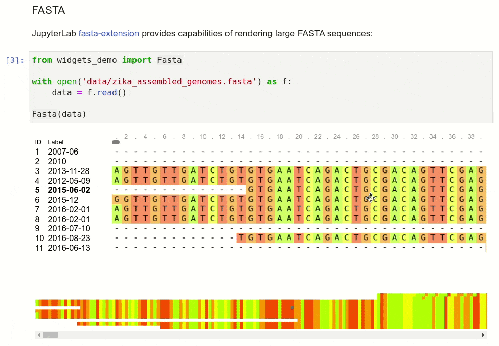
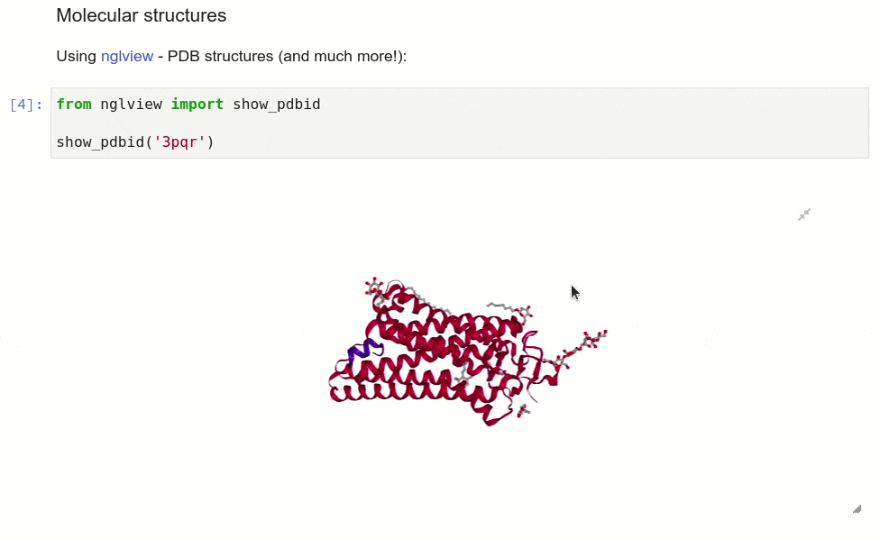
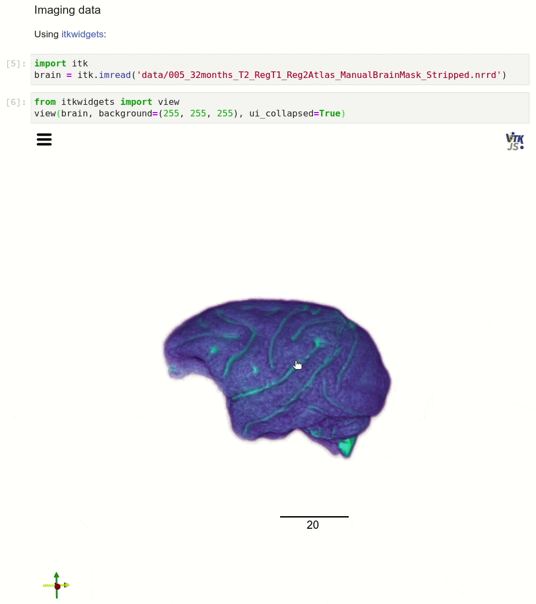
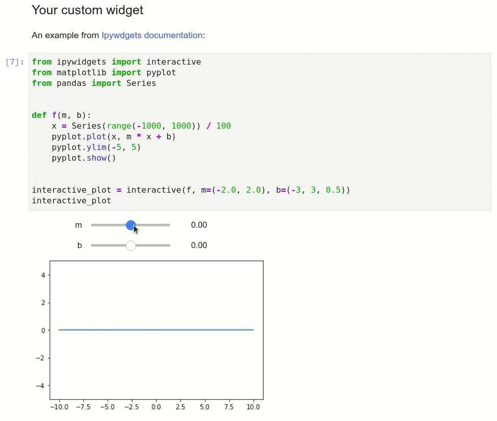

# Computational notebooks for biomedical research

[NGSeminar](https://ngschool.eu/ngseminars/) on the use of Jupyter and R notebooks in biomedical research, available to [watch on YouTube](https://www.youtube.com/watch?v=eXt4MROqTtc).

Run the notebook online: [](https://mybinder.org/v2/gh/krassowski/computational-notebooks-for-biomedical-research/master?urlpath=lab/tree/Slides.ipynb)

### Widgets screencast

If you cannot use the Binder link above, you can view the the notebook on GitHub clicking on `Slides.ipynb` (however, the interactive widgets would not be rendered). For your convenience sreencasts of widgets which may be of use for biomedical researchers are embedded below:










### Dependencies

The Python packages used in the seminar and demonstration are listed in the `requirements.txt` file. You can install them all using pip:

```bash
pip install -r requirements.txt
```

The JupyterLab extensions used are listed in the postBuild file. You can install them by copy-pasting the line which starts with `jupyter labextension install`. In this file you will find also the instructions on downloading the example datasets used in the presentation.
